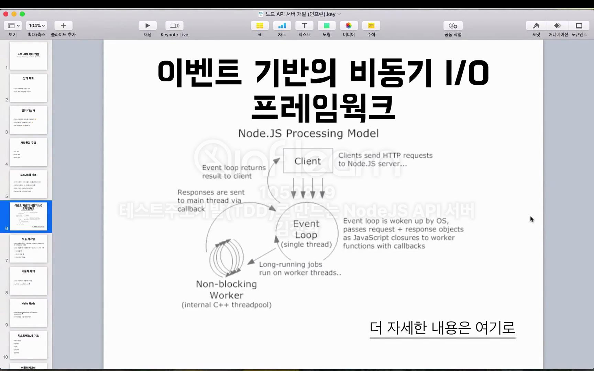
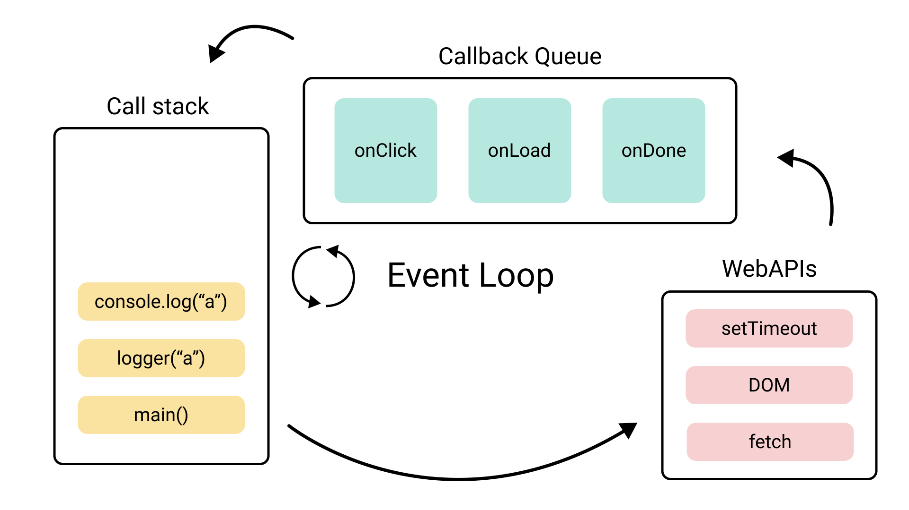

# NodeJS 기초

## 목차
1. [V8 엔진이란?](#v8-엔진이란)
    - [V8 엔진의 역할](#v8-엔진의-역할)
    - [JIT(Just-In-Time)이란?](#jitjust-in-time이란)
    - [AOT(Ahead-Of-Time)이란?](#aotahead-of-time이란)
    - [JIT vs AOT 비교](#jit-vs-aot-비교)
2. [이벤트 기반 비동기 I/O 프레임워크](#이벤트-기반-비동기-io-프레임워크)
    - [1. 이벤트 기반(Event-Driven) 구조란?](#1-이벤트-기반event-driven-구조란)
    - [2. 비동기 I/O란?](#2-비동기-ioran)
    - [3. 이벤트 루프(Event Loop)](#3-이벤트-루프event-loop)
    - [4. Node.js의 비동기 처리 장점](#4-nodejs의-비동기-처리-장점)
    - [5. 비동기 처리 방식의 예시](#5-비동기-처리-방식의-예시)
3. [Node.js 모듈 시스템](#nodejs-모듈-시스템)
    - [1. 모듈 시스템이란?](#1-모듈-시스템이란)
    - [2. CommonJS 모듈 시스템](#2-commonjs-모듈-시스템)
    - [3. ES Modules(ESM)](#3-es-modulesesm)
    - [4. Node.js에서의 모듈 종류](#4-nodejs에서의-모듈-종류)

<br/>
<br/>

## V8 엔진이란?
- V8 엔진은 구글에서 만든 자바스크립트 엔진으로, 자바스크립트 코드를 빠르게 실행할 수 있도록 돕는 핵심적인 역할을 한다. 
- 이 엔진은 구글 크롬 브라우저에서 자바스크립트를 실행하기 위해 개발되었으며, Node.js는 이 **V8 엔진을 사용해서 자바스크립트 코드를 서버 측에서 실행**할 수 있게 한다.

### V8 엔진의 역할
- V8은 자바스크립트 코드를 **기계어로 컴파일**하여 실행하는 엔진이다. 
- 자바스크립트는 원래 인터프리터 언어지만, V8은 자바스크립트 코드를 **JIT(Just-In-Time) 컴파일** 방식으로 컴파일하여 더 빠르게 실행한다.

#### JIT(Just-In-Time)이란?
- **JIT(Just-In-Time) 컴파일**은 프로그램이 **실행되는 순간에** 코드를 **기계어**로 변환하는 방식이다.
- **실행 중 컴파일**: 코드가 실행될 때 그 즉시 컴파일이 이루어진다.
- **동적 최적화**: 프로그램 실행 중에 자주 사용되는 코드 패턴을 최적화하여 성능을 향상시킨다.
- **빠른 실행 시작**: 바로 실행할 수 있지만, 최적화가 필요해지는 시점에서 컴파일이 반복되므로 성능이 일정하지 않을 수 있다.

#### AOT(Ahead-Of-Time)이란?
**AOT(Ahead-Of-Time) 컴파일**은 프로그램을 **실행하기 전에** 미리 모든 코드를 **기계어로 변환**하는 방식이다. 코드를 실행하기 전에 미리 컴파일을 완료하므로, 실행 시점에서는 이미 기계어로 변환된 상태로 프로그램을 빠르게 실행할 수 있다.
- **미리 컴파일**: 코드를 실행하기 전에 모든 컴파일이 완료된다.
- **빠른 실행 시간**: 이미 컴파일된 상태이므로 실행 속도가 매우 빠르다.
- **고정된 최적화**: 실행 중에 추가로 최적화되지 않기 때문에, JIT보다 유연성은 떨어질 수 있다.

#### JIT vs AOT 비교

| 특징         | JIT(Just-In-Time)                | AOT(Ahead-Of-Time)                |
|--------------|----------------------------------|-----------------------------------|
| **컴파일 시점** | 실행 중(실시간)                   | 실행 전(미리 컴파일)               |
| **최적화 방식** | 실행 중에 동적으로 최적화            | 미리 컴파일된 상태로 최적화 완료    |
| **실행 시간**  | 처음 실행 시 컴파일 지연이 발생할 수 있음 | 실행 시작 시 빠름                    |
| **유연성**     | 실행 중에 최적화 반복 가능           | 고정된 상태로 실행                   |

- **JIT**은 프로그램이 실행되는 동안 컴파일을 수행하여 실행 도중에 최적화를 반복할 수 있어 **유연성**이 높다.
- **AOT**는 프로그램이 실행되기 전에 컴파일을 완료하므로 실행 속도가 빠르지만, **실행 중 최적화**는 JIT에 비해 덜 유연하다.

<br/>

## 이벤트 기반 비동기 I/O 프레임워크



### 1. 이벤트 기반(Event-Driven) 구조란?
- **이벤트 기반(Event-Driven)** 구조는 특정 **이벤트**가 발생할 때 미리 정의된 **콜백 함수**가 실행되는 방식이다. 
- Node.js는 **싱글 스레드**로 동작하지만, 비동기적으로 작업을 처리하기 위해 이벤트 기반 구조를 채택했다.

#### 특징
- **비동기 처리**: 요청이 들어오면, 그 작업을 **즉시 처리**하지 않고 이벤트 큐에 넣어 다른 작업을 먼저 처리한다.
- **콜백 함수**: 특정 작업이 완료되면 **콜백 함수**를 통해 결과를 처리하는 방식이다.

### 2. 비동기 I/O(Input/Output)란?
- Node.js의 **비동기 I/O**는 파일 읽기/쓰기, 네트워크 요청 등 **입출력 작업**이 비동기로 처리된다는 의미이다. 
- 이러한 작업들은 시간이 오래 걸릴 수 있기 때문에, **동기적**으로 처리하면 다른 작업들이 차례를 기다려야 하지만, 비동기적 I/O는 **작업이 완료될 때까지 기다리지 않고** 다음 작업을 처리할 수 있다.

#### 비동기 I/O의 특징
- **작업 병렬 처리**: 시간이 오래 걸리는 I/O 작업(파일 읽기, 데이터베이스 요청 등)을 기다리지 않고, **다른 요청**을 먼저 처리할 수 있다.
- **논블로킹(Non-blocking)**: 작업이 끝날 때까지 기다리지 않고, 처리 결과가 준비되면 **콜백 함수**를 호출하여 결과를 처리한다.

### 3. 이벤트 루프(Event Loop)



- Node.js의 비동기 처리의 핵심은 **이벤트 루프**이다. 
- 이벤트 루프는 **싱글 스레드**로 동작하면서, **작업 큐**에 있는 작업들을 하나씩 처리해 나간다.

#### 이벤트 루프의 동작 과정
1. **이벤트 큐**: I/O 작업이 완료될 때까지 기다리는 동안 **이벤트 큐**에 다른 요청들을 넣어 관리한다.
2. **콜백 실행**: 작업이 완료되면 이벤트 큐에서 **콜백 함수를 호출**하여 결과를 처리한다.
3. **반복 처리**: 이벤트 루프는 이러한 과정을 **계속 반복**하여 비동기적으로 작업을 처리한다.

### 4. Node.js의 비동기 처리 장점
- **고성능**: 비동기 I/O 덕분에 많은 요청을 처리할 수 있다. CPU를 많이 사용하지 않는 I/O 중심 작업에서 매우 효율적이다.
- **논블로킹**: I/O 작업이 끝날 때까지 기다리지 않고, 다른 작업들을 처리하여 시스템 자원을 효율적으로 사용할 수 있다.

### 5. 비동기 처리 방식의 예시

- 아래는 **비동기 I/O**와 **이벤트 기반** 처리를 보여주는 간단한 Node.js 예시 코드이다

```javascript
const fs = require('fs');

// 비동기 파일 읽기
fs.readFile('example.txt', 'utf8', (err, data) => {
  if (err) throw err;
  console.log('File content:', data);
});

console.log('File reading started...');
```

1. `fs.readFile`이 호출되면 파일 읽기 작업이 비동기로 시작된다.
2. 이벤트 루프는 파일이 읽혀질 때까지 기다리지 않고, 곧바로 `'File reading started...'`를 출력한다.
3. 파일 읽기가 완료되면, 콜백 함수가 실행되어 파일 내용을 출력한다.

<br/>

## Node.js 모듈 시스템

### 1. 모듈 시스템이란?
**모듈 시스템**은 코드의 재사용성과 유지보수성을 높이기 위해 프로그램을 **작은 단위**로 나누어 관리하는 방법이다. Node.js는 각 파일을 **모듈**로 간주하고, 이를 다른 파일에서 **가져와 사용할 수 있는 구조**를 제공한다. 이를 통해 코드의 복잡도를 줄이고, 독립적인 기능 단위로 나누어 더 쉽게 개발할 수 있다.

### 2. CommonJS 모듈 시스템
Node.js는 기본적으로 **CommonJS** 모듈 시스템을 사용한다. CommonJS는 각 파일을 **모듈**로 정의하며, 이를 **`require`**와 **`module.exports`**를 사용해 불러오고 내보낼 수 있다.

#### `require`와 `module.exports`의 사용법

- **`module.exports`**: 모듈에서 **내보내기**를 할 때 사용된다. 모듈에서 공개할 함수를 정의한 후, 이를 `module.exports`로 지정한다.

  ```javascript
  // math.js
  function add(a, b) {
    return a + b;
  }

  module.exports = add;  // 'add' 함수를 모듈로 내보냄
   ```

- `require`: 다른 파일에서 모듈을 불러오기 할 때 사용한다. require 함수로 불러오면 module.exports로 내보낸 기능을 사용할 수 있다.

   ```javascript
   // app.js
   const add = require('./math');  // 'math.js' 모듈을 불러옴

   console.log(add(2, 3));  // 출력: 5
   ```

#### 특징
- 모듈 단위로 캡슐화: 각 파일은 독립적인 모듈로 동작하며, module.exports로 내보내기 전까지는 해당 모듈의 변수나 함수가 다른 파일에 노출되지 않는다.
- 동기적 로드: CommonJS는 모듈을 동기적으로 불러오기 때문에, 모듈이 로드될 때까지 실행이 멈춘다.

### 3. ES Modules(ESM)
Node.js는 12.x 버전부터 **ECMAScript 모듈(ESM)**을 정식으로 지원하기 시작했다. ES Modules는 더 표준적인 자바스크립트 모듈 시스템으로, 브라우저 환경에서도 동일하게 사용할 수 있다.

#### import와 export의 사용법

   ```javascript
   // math.mjs
   export function add(a, b) {
      return a + b;
   }
   ```
- `export`: 모듈에서 내보낼 함수나 객체를 export로 선언한다.

<br/>

   ```javascript
   // app.mjs
   import { add } from './math.mjs';  // 'math.mjs' 모듈을 불러옴

   console.log(add(2, 3));  // 출력: 5
   ```

- `import`: 다른 파일에서 import로 모듈을 불러올 수 있다.


#### 특징
- 비동기적 로드: ES Modules는 모듈을 비동기적으로 불러오기 때문에, 필요할 때 비동기로 로드할 수 있어 성능에 더 유리하다.
- 브라우저 호환성: ES Modules는 Node.js뿐만 아니라 브라우저에서도 사용할 수 있어, 클라이언트와 서버에서 동일한 모듈 시스템을 사용할 수 있다.

### 4.Node.js에서의 모듈 종류

   ```javascript
    const fs = require('fs');  // 파일 시스템 모듈 불러오기
    const http = require('http');
   ```
- **내장 모듈**: Node.js는 파일 시스템 처리, 네트워크 통신 등을 위한 기본 내장 모듈을 제공한다. 예를 들어, fs, http, path 같은 모듈이 있다.

<br/>

   ```javascript
    // math.js
    function sum(a, b) {
        return a+b;
    }
    module.exports = {
        sum: sum
    }

    // main.js
    const math = require('./math.js')
    const result = math.sum(1,2); // 3
   ```
- **사용자 정의 모듈**: 개발자가 만든 모듈을 다른 파일에서 재사용할 수 있다. 위에서 예시로 든 `math.js`처럼 직접 정의한 모듈을 `require`나 `import`로 불러와 사용할 수 있다.

<br/>

   ```bash
  npm install express  # express 모듈 설치
   ```
   ```javascript
    const express = require('express');  // 외부 모듈 사용
    const app = express();
   ```
- **외부 모듈**: **npm(Node Package Manager)** 을 통해 설치한 외부 라이브러리들도 모듈로 사용할 수 있다.
